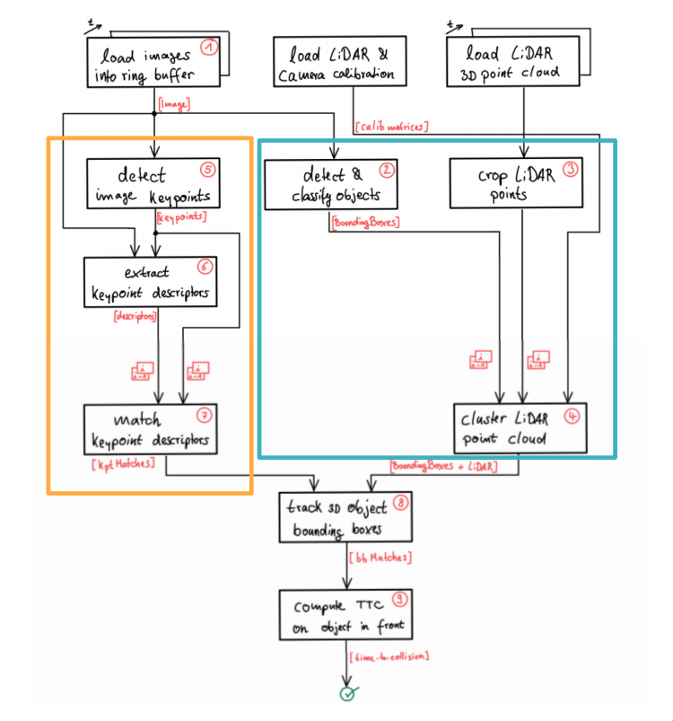

# SFND 3D Object Tracking

Welcome to the final project of the camera course. By completing all the lessons, you now have a solid understanding of keypoint detectors, descriptors, and methods to match them between successive images. Also, you know how to detect objects in an image using the YOLO deep-learning framework. And finally, you know how to associate regions in a camera image with Lidar points in 3D space. Let's take a look at our program schematic to see what we already have accomplished and what's still missing.

In this final project, you will implement the missing parts in the schematic. To do this, you will complete four major tasks: 
1. First, you will develop a way to match 3D objects over time by using keypoint correspondences. 
2. Second, you will compute the TTC based on Lidar measurements. 
3. You will then proceed to do the same using the camera, which requires to first associate keypoint matches to regions of interest and then to compute the TTC based on those matches. 
4. And lastly, you will conduct various tests with the framework. Your goal is to identify the most suitable detector/descriptor combination for TTC estimation and also to search for problems that can lead to faulty measurements by the camera or Lidar sensor. In the last course of this Nanodegree, you will learn about the Kalman filter, which is a great way to combine the two independent TTC measurements into an improved version which is much more reliable than a single sensor alone can be. But before we think about such things, let us focus on your final project in the camera course. 

## Dependencies for Running Locally
* cmake >= 2.8
  * All OSes: [click here for installation instructions](https://cmake.org/install/)
* make >= 4.1 (Linux, Mac), 3.81 (Windows)
  * Linux: make is installed by default on most Linux distros
  * Mac: [install Xcode command line tools to get make](https://developer.apple.com/xcode/features/)
  * Windows: [Click here for installation instructions](http://gnuwin32.sourceforge.net/packages/make.htm)
* Git LFS
  * Weight files are handled using [LFS](https://git-lfs.github.com/)
  * Install Git LFS before cloning this Repo.
* OpenCV >= 4.1
  * This must be compiled from source using the `-D OPENCV_ENABLE_NONFREE=ON` cmake flag for testing the SIFT and SURF detectors.
  * The OpenCV 4.1.0 source code can be found [here](https://github.com/opencv/opencv/tree/4.1.0)
* gcc/g++ >= 5.4
  * Linux: gcc / g++ is installed by default on most Linux distros
  * Mac: same deal as make - [install Xcode command line tools](https://developer.apple.com/xcode/features/)
  * Windows: recommend using [MinGW](http://www.mingw.org/)

## Basic Build Instructions

1. Clone this repo.
2. Make a build directory in the top level project directory: `mkdir build && cd build`
3. Compile: `cmake .. && make`
4. Run it: `./3D_object_tracking`.

## Final Report

### 3D Object Tracking Overview

[//]: # (Image References)
[image1]: ./media/3D_Object_creation.png "3D Object Creation"
[image2]: ./media/Compute_TTC_from_Camera.png "Compute Camera TTC"
[image3]: ./media/Compute_TTC_from_LidarPoints.png "Compute Lidar TTC"
[image4]: ./media/Crop_and_Cluster_LidarPoints.png "Crop Cluster Lidar Points"
[image5]: ./media/Detect_And_Classify_Objects.png "Detect Classify Objects"
[image6]: ./media/KeyPoints_Scaling.png "Keypoints Scaling"
[image7]: ./media/TTC_from_Camera.png "Camera based TTC"
[image8]: ./media/TTC_from_LidarPoints.png "Lidar based TTC"
[image9]: ./media/TTC_lidar_graph.png "Lidar based TTC measurement"
[image10]: ./media/TTC_camera_graph.png "Camera based TTC measurement"
[image11]: ./media/TTC_data_variations.png "Lidar based TTC variations"
[image12]: ./media/Lidar_topview.png "Lidar top view"
[image13]: ./media/Detector_descriptor_Best_5.png "Camera based TTC evaluation"
[image14]: ./media/Detector_AKAZE.png "Detector AKAZE"
[image15]: ./media/Detector_BRISK.png "Detector BRISK"
[image16]: ./media/Detector_FAST.png "Detector FAST"
[image17]: ./media/Detector_Harris.png "Detector Harris"
[image18]: ./media/Detector_ORB.png "Detector ORB"
[image19]: ./media/Detector_ShiTomasi.png "Detector Shi-Tomasi"
[image20]: ./media/Detector_SIFT.png "Detector SIFT"

### Match 3D Objects
Implement the method `matchBoundingBoxes`, which takes as input both the previous and the current data frames and provides as output the ids of the matched regions of interest (i.e. the boxID property). Matches must be the ones with the highest number of keypoint correspondences.

To match the bounding box between frames, we go through all the keypoint match pairs and associate the respective bounding boxes in both frames. We then store the unique box ID of the matches and create a bounding box match pair.

The bounding box pair with the highest number of keypoint match occurrences is then selected as the best pair.

### Compute Lidar-based TTC
The method `computeTTCLidar` is to compute the time-to-collision (TTC) in second for all matched 3D objects using only Lidar measurements from the matched bounding boxes between current and previous frame.

![alt text][image3]

The following formulars will be used for computing TTC from the lidar points

![alt text][image8]

To make the TTC more robust, I have implemented IQR method to filter out the outliers and at the end using a low pass filter to smoothen the TTC output. 

![alt text][image9]

The above chart shows the lidar based TTC over 20 consecutive frames. The TTC value after LPF is still varying a lot, however the linear line shows the time-to-collision is decreasing over time. 

### Associate Keypoint Correspondences with Bounding Boxes
The method `clusterKptMatchesWithROI` is to repare the TTC computation based on camera measurements by associating keypoint correspondences to the bounding boxes which enclose them. All matches which satisfy this condition must be added to a vector in the respective bounding box.

All the keypoint matches belong to the current frame bounding box are grouped and filtered by eleminating the outlier matches based on Euclidean distance between them. 

### Compute Camera-based TTC
The method `computeTTCCamera` is to compute the time-to-collision (TTC) for Camera. The below figure shows how to estimate the distance from camera to preceding vehicle based on the height H. 

![alt text][image2]

The following set of equations shows how to calculate the TTC using the projections from camera sensor.

![alt text][image7]

Similar to lidar based TTC, in order to make the TTC more robust, I have implemented IQR method to filter out the outliers and at the end using a low pass filter to smoothen the TTC output. 

![alt text][image10]

### Performance Evaluation 1
The lidar based TTC estimation sometimes goes wildly, as you can see the below graph.
![alt text][image11]
There maybe two reasons: 
1. Because of using the constant velocity model, so it couldn't reflect exactly when the preceding vehicle speed changes. 
2. Probably the TTC estimation based on comparing between the closest lidar points between the current frame to the previous frame. In order to improve, the averaging of distance from the lidar points may help. 
![alt text][image12]
The above graph shows the lidar points: green - curent frame, red - previous frame. 

### Performance Evaluation 2

The below graphs compare the different TTCs for all detector/descriptor combinations: 
1. SHITOMASI detector and all descriptor combinations

![alt text][image19]

2. HARRIS detector and all descriptor combinations

![alt text][image17]

3. FAST detector and all descriptor combinations

![alt text][image16]

4. BRISK detector and all descriptor combinations

![alt text][image15]

5. ORB detector and all descriptor combinations

![alt text][image18]

6. AKAZE detector and all descriptor combinations

![alt text][image14]

7. SIFT detector and all descriptor combinations

![alt text][image20]

From the above comparison, I picked the best 5 in the below graph. Looks like the best accuracy one is AKAZE detector and ORB descriptor. 

![alt text][image13]

Image index    |  ShiTomasi_ORB  |    FAST_FREAK   |     BRISK_BRIEF  |     AKAZE_ORB    |     SIFT_BRIEF
-------------  | :-------------: | :-------------: | :--------------: | :--------------: | :--------------:         
0	             |    16.179855	   |    12.700775	   |     17.22047	    |     14.133419	   |     11.174084
1	             |    15.784542	   |    14.003867	   |     18.295011	  |     14.406369	   |     11.312928
2	             |    15.090405	   |    20.809173	   |     23.142071	  |     15.846591	   |     12.537697
3	             |    21.92939	   |    17.476459	   |     16.879984	  |     15.491201	   |     15.905578
4	             |    11.518697	   |    17.580268	   |     21.410786	  |     16.863693	   |     20.019266
5	             |    14.681608	   |    17.05224	   |     21.703107	  |     16.601338	   |     14.599628
6	             |    16.349124	   |    4.013378	   |     19.190264	  |     16.110332	   |     13.582231
7	             |    11.706472	   |    18.627146	   |     20.291999	  |     15.627837	   |     16.754116
8	             |    13.910589	   |    10.724099	   |     21.593739	  |     14.921236	   |     15.776936
9	             |    10.721723	   |    10.650783	   |     17.231778	  |     13.580942	   |     13.130799
10	           |    11.660877	   |    15.474801	   |     14.905772	  |     12.173859	   |     11.345579
11	           |    11.286141	   |    17.526312	   |     13.565056	  |     13.514442	   |     11.645166
12	           |    10.760174	   |    12.606194	   |     19.149263	  |     12.89928	   |     10.620103
13	           |    10.609315	   |    9.202975	   |     14.02347	    |     11.653264	   |     9.990572
14	           |    10.022262	   |    10.414689	   |     15.842947	  |     11.470208	   |     10.389111
15	           |    10.886469	   |    9.305059	   |     13.635563	  |     13.090576	   |     9.856369
16	           |    9.98076 	   |    10.182358	   |     14.473125	  |     10.487956	   |     9.468818
17	           |    11.838934	   |    7.876246	   |     14.546157	  |     10.198772	   |     8.99303
18	           |    10.322886	   |    10.95241	   |     11.891726	  |     10.08926	   |     8.548615
19	           |    15.367574	   |    10.670704	   |     12.779955	  |     10.104216	   |     9.542445
